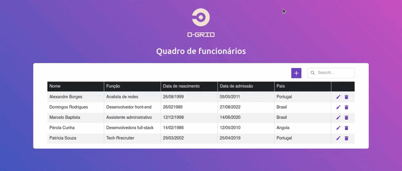

  

## Descrição:

d-Grid é um CRUD em formato de tabela de cadastro de funcionários de uma empresa.

Live do projeto: <a href="https://crud-bootstrap-dev-extreme.vercel.app/">clique aqui.</a>

## Objetivo:
Projeto desenvolvido como teste técnico para uma vaga de desenvolvedor front-end.

## Funcionalidades:
- Cadastra, lê, atualiza e deleta dados.
- Informações persistidas em banco de dados.
- Funciona online.
  
## Tecnologias utilizadas:
-  **DevExtreme** - dessa suíte de componentes UI foi utilizado o componente DataGrid, tabela que renderiza os dados na tela.
-  **React** - utilizado para implementar o DevExtreme DataGrid no projeto através de componentização.
-  **Bootstrap** - biblioteca CSS utilizada na estilização da interface.
-  **Sass** - foi utilizado junto ao Bootstrap, visto que os componentes do DevExtreme já tem estilização própria, e é inviável inserir classes da biblioteca CSS neles uma vez que já são inseridos no DOM com as classes do estilo. Modificar seus estilos requer a criação de uma stylesheet customizada, com regras que sobrepõem os estilos originais. Então, o Sass foi pré-processador CSS utilizado para estender as classes Bootstrap e criar a stylesheet contendo o novo estilo para o DataGrid.
-  **NodeJs** - possibilitou o uso de Javascript na criação da lógica do back-end.
-  **Express** - utilizado na criação da API para comunicação entre o front-end e o banco de dados.
-  **MySQL** - banco de dados utilizado na persistência das informações.
-  **Vite** - ferramenta utilizada na criação do ambiente de desenvolvimento.
-  **Railway** - hospedagem do banco de dados.
-  **Render** - hospedagem do servidor.
-  **Vercel** - hospedagem do front-end.